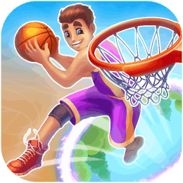
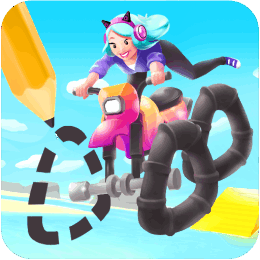

# Tapped 2020–2021

I joined Tapped as a Junior Unity Developer — my first role in the games industry — and it remains one of my favorite experiences to date. I began by contributing to Scribble Rider, where I focused on bug fixes, level design support, and adding small gameplay features.

After that, I helped build our internal mobile game template, which served as the foundation for all our prototypes. I implemented key systems like UI, localization, and an online friends/chat system using PlayFab, designed to be modular so features could be enabled or disabled depending on the game's genre.

I also developed an automated Jenkins build pipeline with Slack integration. This allowed developers to push changes to Git, trigger a Slack command, and receive a testable build (via Diawi) on their devices within minutes — a major quality-of-life improvement for the team.

Later on, I worked on several prototypes launched on the Play Store. While none of them took off, they provided valuable experience in rapid development and iteration. My final project at Tapped was Hoop World, which became a breakout success. I focused on building custom Unity tools to streamline the level design workflow and support the live game’s evolving content.

---

## Hoop World

  

    
    
<strong>10+ Million Downloads</strong>

    
Hoop World is an addictive basketball game where players perform flips and slam dunks through dynamic levels filled with portals and obstacles. Its simple controls and vibrant graphics contributed to over 10 million downloads globally.

    
  

  

    <iframe src="https://www.youtube.com/embed/ZTKZfZE-agc" frameborder="0" allowfullscreen></iframe>
  

---

## Scribble Rider

  

    
    
<strong>120+ Million Downloads</strong> <strong>#1 Game in 25 Countries</strong>

    
Scribble Rider is a hyper-casual mobile game that combines drawing and racing mechanics. Players draw their own vehicle wheels to navigate various terrains and obstacles. The game's unique concept and engaging gameplay led it to top the charts in multiple countries, amassing over 120 million downloads worldwide.

    
  

  

    <iframe src="https://www.youtube.com/embed/Qba_qkCFJcI" frameborder="0" allowfullscreen></iframe>
  

