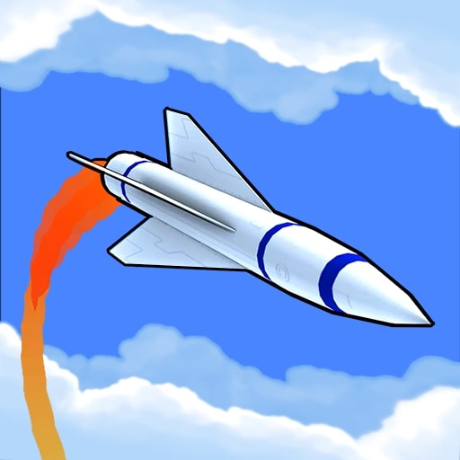
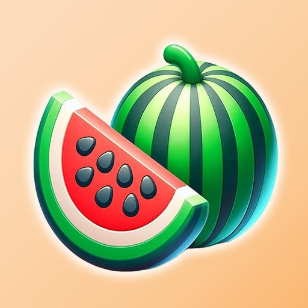

# Vallart (2024-2025)

Together with a coworker that I met at Voodoo, we built the studio from the ground up to try and create new mobile games that Voodoo might be interested in publishing.

For the last year or so we were working together on the weekends to try and make our dreams a reality! 

The workload was pretty split 50/50. I did a lot of programming and a lot of the art/level design/UI for all of these games. 

We attempted to publish these games through the Voodoo platform but sadly they were rejected. It was still a great learning experience!

---

## Missile Attack

  

    
    
<strong>10k+ Downloads</strong>

    
Missile Attack is a fast-paced and challenging arcade game where you take control of a missile and navigate it through a variety of environments to destroy your targets. With simple one-touch controls, you'll need to use your skills and reflexes to avoid obstacles and enemies as you complete your mission.

    
  

  

    <iframe src="https://youtu.be/cEA12Vj141o?si=ipbaFTxl5Q6ZURL9" frameborder="0" allowfullscreen></iframe>
  

## Merge Factory

  

    
    
<strong>100+ Downloads</strong>

    
Merge, Pack & Discovers hundreds of satisfying items!

    
  

  

    <iframe src="https://youtu.be/dDD0e2OKhdw?si=5AcZ8POo8qwQxb3c" frameborder="0" allowfullscreen></iframe>
  

## Missile Master 3D

  

    
    
<strong>1k+ Downloads</strong>

    
We took the base gameplay from Missile Attack and tried to recreate it with a new "distance/goal" based gameplay. One of our weaknesses with the last game was our player retention, so we tried our best to keep the players playing for longer with this one.

    
  

  

    <iframe src="https://www.youtube.com/watch?v=TkTi_4xVpqQ" frameborder="0" allowfullscreen></iframe>
  

## Luggage Quest

  

    
    
<strong>100+ Downloads</strong>

    
Your job is to collect luggage in the correct order and distribute it to the right passengers waiting in line. But be careful—space is limited, so plan your moves wisely to avoid overcrowding!

    
  

  

    <iframe src="https://youtu.be/tNbM6jm5St4?si=DkjHiyh9wm5BTeXI" frameborder="0" allowfullscreen></iframe>
  

